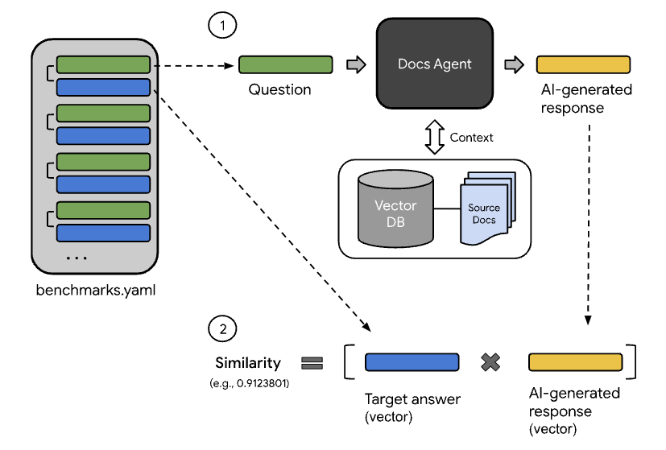

<!-- SPDX-License-Identifier: MPL-2.0 -->
# Benchmark test for monitoring the quality of embeddings and AI responses

This page explains how to run benchmark test to measure and track
the quality of embeddings, context chunks, and AI-generated responses.

Docs Agent’s benchmark test currently uses 10 questions and their
target answers curated by technical writers (see
[`benchmarks.yaml`][benchmarks-yaml]). The benchmark test asks these
10 questions to an AI language model to generate responses. The test then
computes the dot product of the embeddings (vectors) of these AI-generated
responses and the target answer to measure their similarity values
(see Figure 1).



**Figure 1**. The dot product of vectors is computed to measure their similarity.

**Note**: The input questions and answers in the
[`benchmarks.yaml`][benchmarks-yaml] file checked in the Docs Agent project are
based on the [FAQ][flutter-faq] page on the Flutter documentation site, whose
source Markdown files are available in this [Flutter repository][flutter-git]).

## Set up and run the benchmark test

To set up and run benchmark test using Docs Agent, the steps are:

1. [Prepare questions and target answers for your source docs](#1_prepare-questions-and-target-answers-for-your-source-docs).
2. [Set up Docs Agent](#2_set-up-docs-agent).
3. [Run the benchmark test](#3_run-the-benchmark-test).

### 1. Prepare questions and target answers for your source docs

List questions and target answers for your source docs in the `benchmarks.yaml`
file.

An example of a question and target answer pair:

```none
  - question: "Does Flutter support Material Design?"
    target_answer: "Yes! The Flutter and Material teams collaborate closely, and Material is fully supported. For more information, check out the Material 2 and Material 3 widgets in the widget catalog."
```

Based on the information documented in your source docs, come up
with a list of questions (`question`) and their expected answers
(`target_answer`). It’s important that these answers are found in
the source docs and are produced by humans, not AI models.

For instance, the example [`benchmarks.yaml`][benchmarks-yaml] file includes
10 questions and 10 target answers that are based on the source documents in
the [Flutter repository][flutter-git]. So if you plan on running benchmark
test using this `benchmarks.yaml` file, you need to configure your
Docs Agent setup so that it uses the documents in the Flutter repository
as a knowledge source, for example:

```yaml
inputs:
  - path: "/usr/local/home/user01/website/src"
    url_prefix: "https://docs.flutter.dev"
```

(Source: [`config.yaml`][config-yaml])

### 2. Set up Docs Agent

Complete the processing of your source docs into Docs Agent’s vector
database (by running the `agent chunk` and `agent populate` commands).

**Note**: This benchmark testing uses the same `config.yaml` file as the
chatbot app (that is, `condition_text`, `vector_db_dir`, and `log_level`
variables and so on). For instance, set `log_level` to `NORMAL`
if you do not wish to see the details of prompts to the AI model while
the benchmark test is running.

### 3. Run the benchmark test

To start benchmark test, run the following command from your Docs Agent
project home directory:

```sh
agent benchmark
```

This command computes the similarity value for each question entry
in the `benchmarks.yaml` file and writes the test results
to the [`results.out`][results-out] file. If there already
exists a `results.out` file, its content will be overwritten.

An example of test results:

```none
Similarity (-1, 1)    Question
==================    ========
0.9693597667161213    What is inside the Flutter SDK?
0.8810758779307981    Does Flutter work with any editors or IDEs?
0.8760932771858571    Does Flutter come with a framework?
0.8924252745816632    Does Flutter come with widgets?
0.8637181105900334    Does Flutter support Material Design?
0.9340505894484676    Does Flutter come with a testing framework?
0.9192416276439515    Does Flutter come with debugging tools?
0.7491969164696617    Does Flutter come with a dependency injection framework?
0.7895399136265219    What technology is Flutter built with?
0.7802681514431923    What language is Flutter written in?
```

**Note**: The similarity scores shown in the example above are
computed using only a small set of documents processed from the
Flutter respository. These scores may vary depending on which
documents are added into Docs Agent's knowledge source.

## How does this benchmark test work?

When Docs Agent's benchmark test is run, the following events
take place:

1. Read a `question` and `target_answer` entry from the
   [`benchmarks.yaml`][benchmarks-yaml] file.
2. Generate an embedding using `target_answer` (Embedding 1).
3. Ask `question` to the AI model using the RAG technique.
4. Generate an embedding using the AI-generated response
   (Embedding 2).
5. Compute the similarity between Embedding 1 and Embedding 2.
6. Repeat the steps until all question entries are read.
7. Print the test results to the [`results.out`][results-out] file.

## How is the similarity value computed?

To measure the similarity, each benchmark test calculates the
dot product of the embedding (vector) generated from the target
answer and the embedding generated from the AI response.

An example of a benchmark test result:

```none
Question:
Does Flutter come with debugging tools?

Target answer:
Yes, Flutter comes with Flutter DevTools (also called Dart DevTools). For more information, see Debugging with Flutter and the Flutter DevTools docs.

AI Response:
Yes, Flutter has debugging tools. You can debug your app in a few ways:

 • Using DevTools, a suite of debugging and profiling tools that run in a browser and include the Flutter inspector.
 • Using Android Studio's (or IntelliJ's) built-in debugging features, such as the ability to set breakpoints.
 • Using the Flutter inspector, directly available in Android Studio and IntelliJ.

Similarity:
0.9192416276439515
```

This value estimates the similarity between the human-produced
and machine-generated answers. The closer the value is to 1,
the more similar they are. (For more information , see the
[Embedding guide][embedding-generation] page on the Gemini API
documentation site.)

<!-- Reference links -->

[benchmarks-yaml]: benchmarks.yaml
[config-yaml]: ../../config.yaml
[flutter-faq]: https://docs.flutter.dev/resources/faq
[flutter-git]: https://github.com/flutter/website/tree/main/src
[results-out]: results.out
[embedding-generation]: https://ai.google.dev/docs/embeddings_guide
